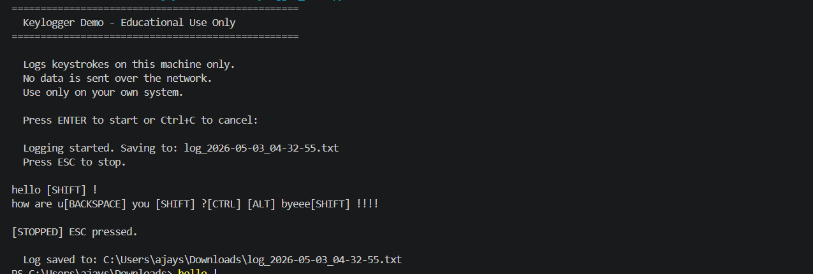

# PRODIGY_CS_04 — Keylogger Demo Tool
> 🔐 Task 4 | Prodigy InfoTech Cybersecurity Internship

---

## 📌 About the Project

A keylogger is a program that records keyboard input. This project demonstrates how a basic keylogger works in a safe and ethical way.

Before logging starts, the program displays a notice and waits for the user to press **ENTER** to begin. All captured data is stored locally on your system — nothing is transmitted or shared.

This project is built strictly for educational purposes as part of the Prodigy InfoTech Cybersecurity Internship.

---

## 🛠️ Features

* ✅ Displays notice before logging begins
* ✅ Starts only after user presses ENTER
* ✅ Real-time key capture with live display
* ✅ Saves keystrokes to a local log file
* ✅ Formats special keys like `[SHIFT]`, `[CTRL]`, `[BACKSPACE]`
* ✅ Thread-safe file writing (prevents data corruption)
* ✅ Timestamped log files (no overwriting of previous sessions)

---

## 🚀 How to Run

Make sure Python 3 is installed, then install the required library:

```bash
pip install pynput
```

**Windows:**
```bash
python keylogger.py
```

**Linux / Mac:**
```bash
python3 keylogger.py
```

---

## 💻 Sample Output

**On Screen:**
```
  [STARTED] Logging to: log_2025-06-15_14-30-00.txt
  Keys will appear below. Press ESC to stop.

hello [SHIFT] World
```

**Log File:**
```
--- session started at 2025-06-15 14:30:00 ---

hello [SHIFT] World

--- logging stopped at 2025-06-15 14:31:22 ---
```

---

## 📸 Screenshot

### ▶️ Output


---

## 📁 File Structure

```
PRODIGY_CS_04/
│
├── keylogger.py
├── README.md
├── output.png
└── log_YYYY-MM-DD_HH-MM-SS.txt
```

---

## 🧠 How It Works

1. A notice is displayed before logging starts
2. User presses ENTER to begin
3. A timestamped log file is created
4. `pynput` listens for keyboard events in the background
5. Keys are formatted into readable output
6. Output is printed and saved simultaneously
7. `threading.Lock()` ensures safe file writing
8. Press **ESC** to stop and close the file cleanly

---

## 🔑 Key Concepts

| Concept | Purpose |
|---|---|
| `pynput` | Captures keyboard events |
| `SPECIAL_KEY_MAP` | Converts special keys to readable labels |
| `threading.Lock()` | Prevents file write conflicts |
| `on_press()` | Handles each key press |
| `keyboard.Listener` | Runs listener in background thread |
| Timestamped logs | Keeps each session separate |

---

## ⚠️ Limitations

* Does not capture clipboard data
* Does not track mouse activity
* Only logs during active runtime
* Works only on the local system

---

## 🔒 Ethical Note

* Only run this on your own system
* Do not use it on others' devices
* For educational purposes only
* All data stays on your machine (no transmission)

---

## 👨‍💻 Author

**Anjali Kunwar Simari**
Cybersecurity Intern @ Prodigy InfoTech

---

## 🏷️ Tags

#Cybersecurity #Python #Keylogger #pynput #ProdigyInfoTech
